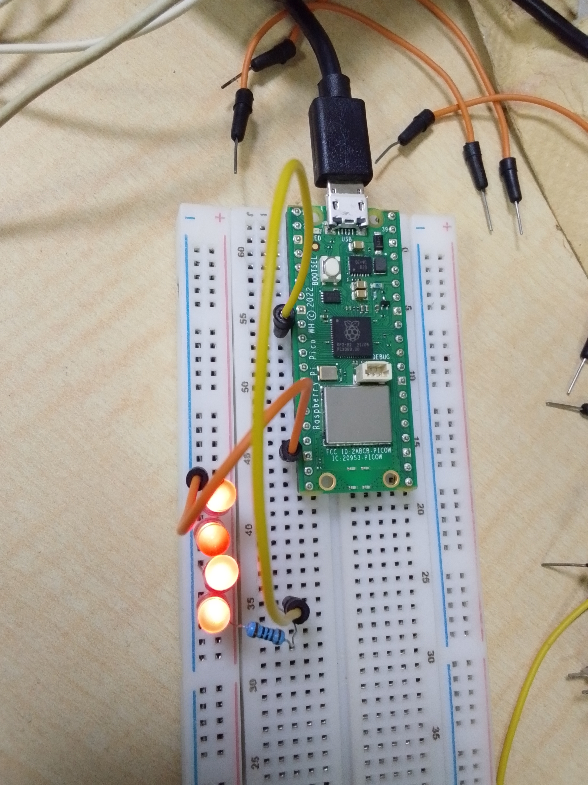

# LED-Control-through-User-Input-using-Raspberry-Pi-Pico-W
This project demonstrates command-based LED control using serial terminal input with the Raspberry Pi Pico W.

## Project Overview
The user enters commands through the terminal to control an LED connected to the Raspberry Pi Pico W.

Supported commands:
- ON
- OFF
- TOGGLE

## Components Used
- Raspberry Pi Pico W
- LED
- 220Ω resistor
- Breadboard
- Jumper wires

## GPIO Connection
- LED → GPIO 6

## Learning Outcome
- User input handling
- Command-based control systems
- GPIO output control
- Interactive embedded programming
- Serial terminal communication

## Project images

## Project Code
[Click here for the project code](code/controlling_led_light_using_if_else_statement_project.py)

## Project Demo video
[Click here for the project Demo video](https://youtube.com/shorts/eqeLzLLk5Rs)
